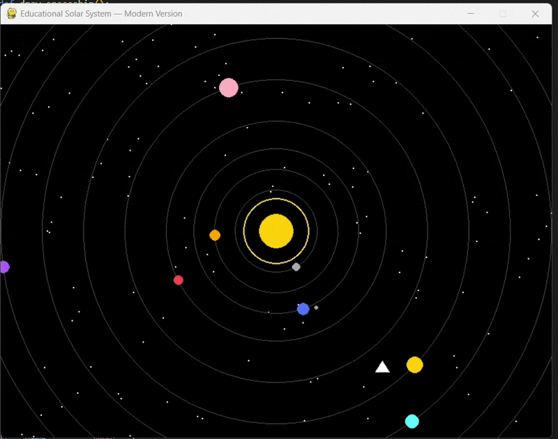

# 🌌 Educational Solar System

A beginner-friendly **Solar System simulation** built in **Python (Pygame)**.  
Planets orbit the sun, a spaceship flies by, and a starfield background completes the scene.  
Originally adapted from a legacy C++/BGI graphics project — now fully modernized for Windows, macOS, and Linux.

---

## 🪐 Demo Preview
  

---

## 🧰 Features
- Animated sun with glowing effect 🌞  
- Realistic circular orbits for all major planets  
- Earth with a rotating moon 🌕  
- Randomly twinkling starfield ✨  
- Simple moving spaceship animation 🚀  
- Smooth performance using the Pygame game loop  

---
🧠 How It Works

Each planet’s position is calculated using:

x = CENTER_X + orbit_radius * cos(angle)
y = CENTER_Y + orbit_radius * sin(angle)

The angle increases each frame to create smooth orbital motion.
The game loop redraws the sun, planets, and spaceship at 60 FPS.

🪄 Future Enhancements

Add textures or planet images instead of simple circles 🌍

Include sound/music with pygame.mixer 🎶

Add an information panel for each planet 🪐

Create a 3D version using pygame.math.Vector3 or three.js (for web)
